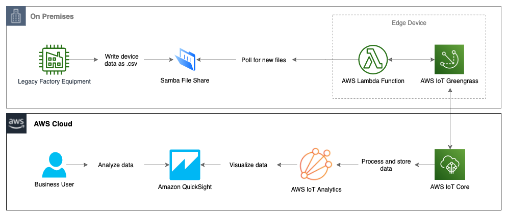
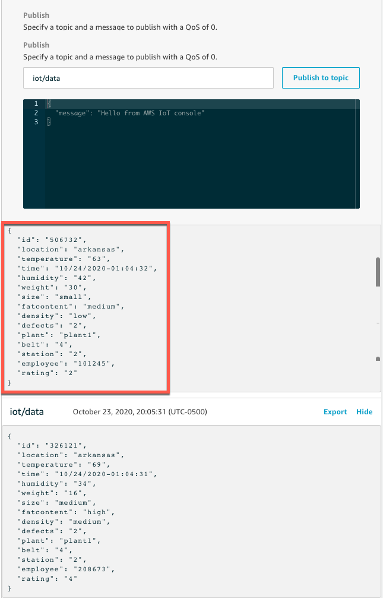
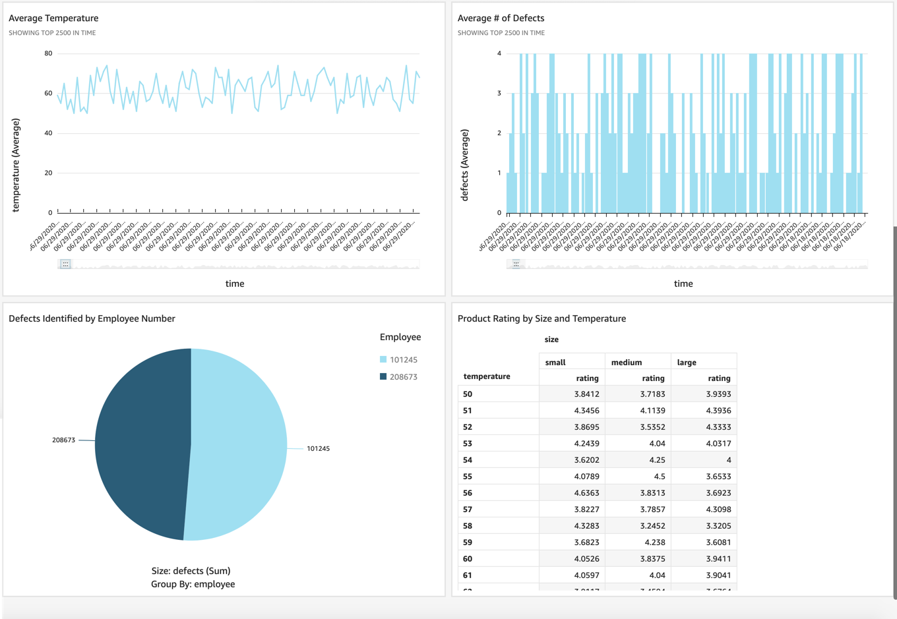

# Ingest and visualize your flat-file IoT data with AWS IoT services

Customers who maintain manufacturing facilities often find it challenging to ingest, centralize, and visualize IoT data that is emitted in flat-file format from their factory equipment. While modern IoT-enabled industrial devices can communicate over standard protocols like MQTT, there are still some legacy devices that generate useful data but are only capable of writing it locally to a flat file. This results in siloed data that is either analyzed in a vacuum without the broader context, or it is not available to business users to be analyzed at all.

AWS provides a suite of [IoT](https://aws.amazon.com/iot/) and [Edge](https://aws.amazon.com/edge/services/) services that can be used to solve this problem. In this blog, I will walk you through one method of leveraging these services to ingest hard-to-reach data into the AWS cloud and extract business value from it.


# Overview of solution

This solution provides a working example of an edge device running [AWS IoT Greengrass](https://aws.amazon.com/greengrass/?nc=sn&loc=2&dn=2) with an [AWS Lambda](https://aws.amazon.com/lambda/) function that watches a Samba file share for new .csv files (presumably containing device or assembly line data). When it finds a new file, it will transform it to JSON format and write it to [AWS IoT Core](https://aws.amazon.com/iot-core/?nc=sn&loc=2&dn=3). The data is then sent to [AWS IoT Analytics](https://aws.amazon.com/iot-analytics/?nc=sn&loc=2&dn=6) for processing and storage, and [Amazon QuickSight](https://aws.amazon.com/quicksight/) is used to visualize and gain insights from the data.



Since we don't have an actual on-premises environment to use for this walkthrough, we'll simulate pieces of it:
- In place of the legacy factory equipment, an EC2 instance running Windows Server 2019 will generate data in .csv format and write it to the Samba file share.
    > We're using a Windows Server for this function to demonstrate that the solution is platform-agnostic. As long as the flat file is written to a file share, AWS IoT Greengrass can ingest it.
- An EC2 instance running Amazon Linux will act as the edge device and will host AWS IoT Greengrass Core and the Samba share. 
    > In the real world, these could be two separate devices, and the device running AWS IoT Greengrass could be as small as a [Raspberry Pi](https://www.raspberrypi.org/).

# Prerequisites 
For this walkthrough, you should have the following prerequisites:
* An [AWS Account](https://signin.aws.amazon.com/signin?redirect_uri=https%3A%2F%2Fportal.aws.amazon.com%2Fbilling%2Fsignup%2Fresume&client_id=signup)
* Access to provision and delete AWS resources
* Basic knowledge of Windows and Linux server administration
* If you're unfamiliar with AWS IoT Greengrass concepts like Subscriptions and Cores, check out the [AWS IoT Greengrass documentation](https://docs.aws.amazon.com/greengrass/latest/developerguide/what-is-gg.html) for a detailed description.


# Walkthrough
First, we’ll show you the steps to launch the AWS IoT Greengrass resources using AWS CloudFormation. The AWS CloudFormation template is derived from the template provided in [this blog post](https://aws.amazon.com/blogs/iot/automating-aws-iot-greengrass-setup-with-aws-cloudformation/). Check out the post for a detailed description of the template and its various options.
1. [Create a key pair](https://docs.aws.amazon.com/AWSEC2/latest/UserGuide/ec2-key-pairs.html#prepare-key-pair).
1. [Launch a new AWS CloudFormation stack](https://docs.aws.amazon.com/AWSCloudFormation/latest/UserGuide/cfn-console-create-stack.html) in the N. Virginia (us-east-1) Region using <a href="https://github.com/aws-samples/aws-iot-greengrass-flat-file-ingestion/raw/main/iot-cfn.yml" download>iot-cfn.yml</a>, which represents the simulated environment described in the preceding bullet. 
    - Parameters:
        - Name the stack `IoTGreengrass`.
        - For `EC2KeyPairName`, use the EC2 key pair you just created for. Leave off the `.pem` extension.
        - For `SecurityAccessCIDR`, use your public IP with a /32 CIDR (i.e. `1.1.1.1/32`). 
            - You can also accept the default of `0.0.0.0/0` if you can have SSH and RDP being open to all sources on the EC2 instances in this demo environment.
        - Accept the defaults for the remaining parameters.
    - View the `Resources` tab after stack creation completes. The stack creates the following resources:
        - A VPC with two subnets, two route tables with routes, an internet gateway, and a security group.
        - Two EC2 instances, one running Amazon Linux and the other running Windows Server 2019.
        - An IAM role, policy, and instance profile for the Amazon Linux instance.
        - A Lambda function called `GGSampleFunction`, which we'll update with code to parse our flat-files with AWS IoT Greengrass in a later step.
        - An AWS IoT Greengrass Group, Subscription, and Core.
        - Other supporting objects and custom resource types. 
    - View the `Outputs` tab and copy the IPs somewhere handy. You'll need them for multiple provisioning steps below.
1. Review the AWS IoT Greengrass resources created on your behalf by AWS CloudFormation:
    - Search for `IoT Greengrass` in the Services drop-down menu and select it.
    - Click `Manage your Groups`.
    - Click `file_ingestion`. 
    - Navigate through the `Subscriptions`, `Cores`, and other tabs to review the configurations.

Leveraging a device running AWS IoT Greengrass at the edge, we can now interact with flat-file data that was previously difficult to collect, centralize, aggregate, and analyze.

## Setup the Samba file share
We will now setup the Samba file share where we will write our flat-file data. In our demo environment, we're creating the file share on the same server that runs the AWS IoT Greengrass software. In the real world, this file share could be hosted elsewhere as long as the device that runs AWS IoT Greengrass can access it via the network.

1. Follow the instructions in [setup_file_share.md](docs/setup_file_share.md) to setup the Samba file share on the Greengrass EC2 instance.
1. Keep your terminal window open. You'll need it again for a later step.


## Configure Lambda Function for Greengrass AWS IoT Greengrass
AWS IoT Greengrass provides a Lambda runtime environment for user-defined code that you author in AWS Lambda. Lambda functions that are deployed to an AWS IoT Greengrass Core run in the Core's local Lambda runtime. In this example, we'll update the Lambda function created by CloudFormation with code that watches for new files on the Samba share, parses them, and writes the data to an MQTT topic.

1. Update the Lambda function:
    - Search for `Lambda` in the Services drop-down menu and select it.
    - Select the `file_ingestion_lambda` function.
    - From the `Function code` pane, click `Actions` then `Upload a .zip file`.
    - Upload <a href="https://github.com/aws-samples/aws-iot-greengrass-flat-file-ingestion/blob/main/dist/file_ingestion_greengrass_lambda.zip?raw=true" download>the provided zip file</a> containing the Lambda code.
    - Select `Actions` > `Publish new version` > `Publish`.
1. Update the Lambda Alias to point to the new version.
    - Select the `Version: X` drop-down ("X" being the latest version number). 
    - Choose the `Aliases` tab and select `gg_file_ingestion`.
    - Scroll down to `Alias configuration` and select `Edit`. 
    - Choose the newest version number and click `Save`.
        > Do NOT use $LATEST as it is not supported by AWS IoT Greengrass.
1. Associate the Lambda function with AWS IoT Greengrass.
    - Search for `IoT Greengrass` in the Services drop-down menu and select it.
    - Select `Groups` and choose `file_ingestion`.
    - Select `Lambdas` > `Add Lambda`.
    - Click `Use existing Lambda`.
    - Select `file_ingestion_lambda` > `Next`.
    - Select `Alias: gg_file_ingestion` > `Finish`.
    - You should now see your Lambda associated with the AWS IoT Greengrass group.
    - Still on the Lambda function tab, click the ellipsis and choose `Edit configuration`.
    - Change the following Lambda settings then click `Update`:
        - Set `Containerization` to `No container (always)`.
        - Set `Timeout` to 25 seconds (or longer if you have large files to process). 
        - Set `Lambda lifecycle` to `Make this function long-lived and keep it running indefinitely`.

## Deploy AWS IoT Greengrass Group
1. Restart the AWS IoT Greengrass daemon:
    - A daemon restart is required after changing containerization settings. Run the following commands on the Greengrass instance to restart the AWS IoT Greengrass daemon:
        ```bash
        cd /greengrass/ggc/core/
        sudo ./greengrassd stop
        sudo ./greengrassd start
        ```
1. Deploy the Greengrass Group to the Core device.
    - Return to the `file_ingestion` Greengrass Group in the console.
    - Select `Actions` > `Deploy`.
    - Select `Automatic detection`.
    - After a few minutes, you should see a `Status` of `Successfully completed`. If the deployment fails, [check the logs](https://docs.aws.amazon.com/greengrass/latest/developerguide/gg-troubleshooting.html#troubleshooting-logs), fix the issues, and deploy again.

## Generate test data  
You can now generate test data that is ingested by AWS IoT Greengrass, written to AWS IoT Core, and then sent to AWS IoT Analytics and visualized by Amazon QuickSight.

1. Follow the instructions in [generate_test_data.md](docs/generate_test_data.md) to generate the test data.
1. Verify that the data is being written to AWS IoT Core following [these instructions](https://docs.aws.amazon.com/greengrass/latest/developerguide/lambda-check.html) (Use `iot/data` for the MQTT Subscription Topic instead of `hello/world`).

    

## Setup AWS IoT Analytics
Now that our data is in AWS IoT Cloud, it only takes a few clicks to configure AWS IoT Analytics to process, store, and analyze our data.

1. Search for `IoT Analytics` in the Services drop-down menu and select it.
1. Set `Resources prefix` to `file_ingestion` and `Topic` to `iot/data`. Click `Quick Create`.
1. Populate the data set by selecting `Data sets` > `file_ingestion_dataset` >`Actions` > `Run now`. 
    > If you don't get data on the first run, you may need to wait a couple of minutes and run it again.


## Visualize the Data from AWS IoT Analytics in Amazon QuickSight
We can now use Amazon QuickSight to visualize the IoT data in our AWS IoT Analytics data set. 

1. Search for `QuickSight` in the Services drop-down menu and select it.
1. If your account is not signed up for QuickSight yet, follow [these instructions](https://docs.aws.amazon.com/quicksight/latest/user/signing-up.html) to sign up (use Standard Edition for this demo)
1. Build a new report:
    - Click `New analysis` > `New dataset`.
    - Select `AWS IoT Analytics`.
    - Set `Data source name` to `iot-file-ingestion` and select `file_ingestion_dataset`. Click `Create data source`.
    - Click `Visualize`. Wait a moment while your rows are imported into SPICE. 
    - You can now drag and drop data fields onto field wells. Review the [QuickSight documentation](https://docs.aws.amazon.com/quicksight/latest/user/creating-a-visual.html) for detailed instructions on creating visuals. 
    - Following is an example of a QuickSight dashboard you can build using the demo data we generated in this walkthrough.

        

# Cleaning up

Be sure to clean up the objects you created to avoid ongoing charges to your account. 
- In Amazon QuickSight, [Cancel your subscription](https://docs.aws.amazon.com/quicksight/latest/user/closing-account.html).
- In AWS IoT Analytics, delete the datastore, channel, pipeline, data set, role, and topic rule you created.
- In CloudFormation, delete the `IoTGreengrass` stack.
- In [Amazon CloudWatch](https://aws.amazon.com/cloudwatch/), delete the log files associated with this solution.

# Conclusion
Gaining valuable insights from device data that was once out of reach is now possible thanks to AWS's suite of IoT services. In this walkthrough, we collected and transformed flat-file data at the edge and sent it to IoT Cloud using AWS IoT Greengrass. We then used AWS IoT Analytics to process, store, and analyze that data, and we built an intelligent dashboard to visualize and gain insights from the data using Amazon QuickSight. You can use this data to discover operational anomalies, enable better compliance reporting, monitor product quality, and many other use cases.

For more information on AWS IoT services, check out the overviews, use cases, and case studies on our [product page](https://aws.amazon.com/iot/). If you're new to IoT concepts, I'd highly encourage you to take our free [Internet of Things Foundation Series](https://www.aws.training/Details/Curriculum?id=27289) training.
