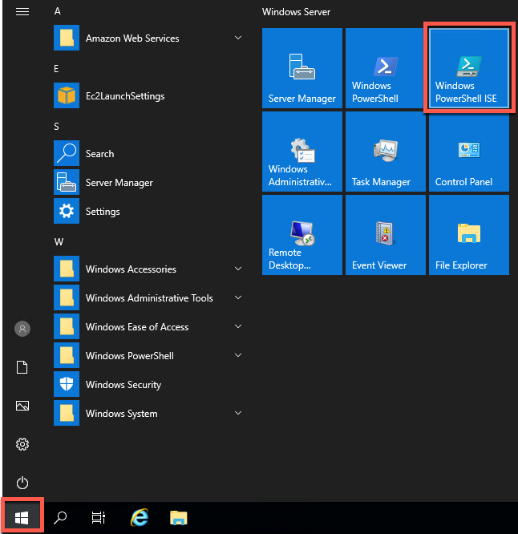
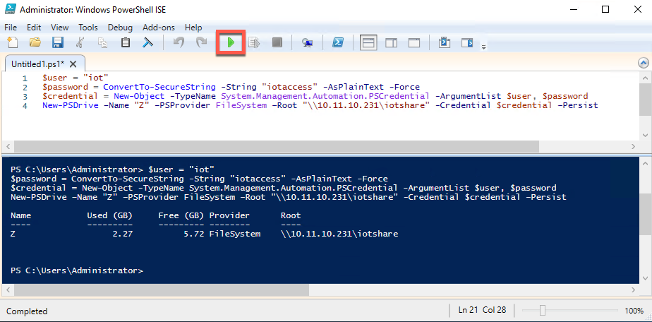
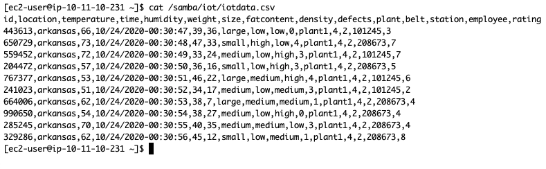

# Ingest and visualize your flat-file IoT data with AWS IoT services

Ingesting and visualizing flat-file data in the same centralized location as your other IoT data can be challenging, especially with older legacy devices. While modern IoT-enabled industrial devices can communicate over standard protocols like MQTT, there are still some legacy devices that generate useful data but are only capable of writing it locally to a flat file (i.e. csv). This results in siloed data that is either analyzed in a vacuum without the broader context within which it exists, or it is not made available to business users to be analyzed at all. 

AWS provides a suite of IoT and Edge services that can be used to solve this problem. In this blog, I will walk you through one method of leveraging these services to ingest this hard-to-reach data into the AWS cloud and extract business value from it.


# Solution Overview

This solution provides a working example of an edge device running [AWS IoT Greengrass](https://aws.amazon.com/greengrass/?nc=sn&loc=2&dn=2) with a Lambda function that watches a Samba file share for new .csv files (presumably containing device or assembly line data). When it finds a new file, it will transform it to JSON format and write it to [AWS IoT Core](https://aws.amazon.com/iot-core/?nc=sn&loc=2&dn=3). The data is then sent to [AWS IoT Analytics](https://aws.amazon.com/iot-analytics/?nc=sn&loc=2&dn=6) for processing and storage, and [Amazon QuickSight](https://aws.amazon.com/quicksight/) is used to visualize and gain insights from the data.


Since we don't have an actual on-premises environment to use for this walkthrough, we'll be simulating pieces of it:
- An EC2 instance running Windows Server 2019 will generate data in .csv format and will write it to the Samba file share in place of the legacy factory equipment. 
    > We're using a Windows server for this function to demonstrate that the solution is platform agnostic. As long as the flat file can get to a file share, Greengrass can ingest it.
- An EC2 instance running Amazon Linux will act as the edge device and will host AWS IoT Greengrass and the Samba share. 
    > In the real world, these could be two separate devices, and the device running Greengrass could be as small as a Raspberry Pi.

# Deployment

## Pre-Requisites
Complete the following steps to initialize the demo environment:
1. Clone this repo to your local environment.
1. [Create a keypair](https://docs.aws.amazon.com/AWSEC2/latest/UserGuide/ec2-key-pairs.html#prepare-key-pair) if you don't already have one.
1. [Launch a new CloudFormation stack](https://docs.aws.amazon.com/AWSCloudFormation/latest/UserGuide/cfn-console-create-stack.html) using [cfn.yml](cfn.yml). 
    - Name the stack `IoTGreengrass`.
    - For the `EC2KeyPairName` parameter, replace the parameter value `your-keypair-name` with the name of your key pair. 
    - Click `Next` twice, select `I acknowledge that AWS CloudFormation might create IAM resources with custom names`, then click `Create stack`.
    
        

The CloudFormation stack will create the following AWS resources:
- A VPC with public and private subnets, route tables, and security groups.
- An Amazon Linux server, which runs the AWS IoT Greengrass Core software at the edge and hosts a samba share. 
- A Windows server, which generates data and writes it to a flat-file on the samba share. 

## Setup AWS IoT Greengrass 
AWS IoT Greengrass seamlessly extends AWS to edge devices so they can act locally on the data they generate, while still using the cloud for management, analytics, and durable storage. Leveraging a device running Greengrass at the edge, we can interact with flat-file data that was previously difficult to collect, centralize, aggregate, and analyze.

1. Create a Greengrass Group and Core in the AWS Console:
    - Search for `Greengrass` in the Services drop-down menu and select `AWS IoT Greengrass`.
    
        
    - Select `Create a Group`.
    
        
    - Choose `Use default creation`.
    
        
    - Name your group `file_ingestion` and click `Next`.
    
        
    - Accept the default for the Core name and click `Next`.
    
        
    - Review the actions AWS IoT Greengrass will take on your behalf and select `Create Group and Core`.
    
        
    - Download the `tar.gz` file containing your Core's keys, certificate, and config file. Click `Finish`. 
        > We'll download the Core software and choose a root CA in a subsequent step - no need to do it here.
    
        
    - You should now see your Greengrass group created in the console.
    
        
1. Configure the Greengrass Core software on the Linux server created by the CloudFormation stack.
    > NOTE: These steps are derived from the [AWS IoT Greengrass Getting Started Guide](https://docs.aws.amazon.com/greengrass/latest/developerguide/setup-filter.ec2.html).
    - Login to the Greengrass EC2 instance.
        - Search for `EC2` in the Services drop-down menu and select it.
        - You should see two running instances. Select `Instances` to view them.
        
            
        - Select the instance named `Greengrass` and write down its public IP.
        
            
        - Allow ssh traffic to communicate with the instance from your IP.
            - Select the Security tab and click on the link for the security group.
            
                
            - Click `Edit inbound rules`.

                
            - Add a rule to allow ssh traffic from your IP (Source = "My IP"), and click `Save rules`.
            
                
        - [Login to the Linux server via ssh](https://docs.aws.amazon.com/AWSEC2/latest/UserGuide/AccessingInstancesLinux.html) using the keypair that you created earlier.
    - Install and configure pre-requisites.
        - Execute the following commands to install updates and setup users:
            ```bash
            # Apply updates
            sudo yum update -y 

            # Setup users and permissions permissions
            sudo adduser --system ggc_user
            sudo groupadd --system ggc_group
            ```
        - Ensure hardlinks and softlinks are protected.
            
            Execute the following command:
            ```bash
            # Check if hardlinks and softlinks are protected
            sudo sysctl -a | grep fs.protected
            ```
            You are checking to make sure the following lines exist in the output:
            ```config
            fs.protected_hardlinks = 1
            fs.protected_symlinks = 1
            ```
            If those lines to not exist in the output, add them to the `/etc/sysctl.d/99-amazon.conf` file with the text editor of your choice and then reboot the server.
        - Install Linux control groups (cgroups) to set Lambda member limits and support containerization:
            ```bash
            cd ~
            curl https://raw.githubusercontent.com/tianon/cgroupfs-mount/951c38ee8d802330454bdede20d85ec1c0f8d312/cgroupfs-mount > cgroupfs-mount.sh
            chmod +x cgroupfs-mount.sh 
            sudo bash ./cgroupfs-mount.sh
            ```
        - Install Java 8 runtime and Python3.7:
            ```bash
            # Install Java
            sudo yum install -y java-1.8.0-openjdk
            sudo ln -s /etc/alternatives/java /usr/bin/java8

            # Install Python
            sudo yum install -y gcc openssl-devel bzip2-devel libffi-devel
            cd /opt
            sudo wget https://www.python.org/ftp/python/3.7.7/Python-3.7.7.tgz
            sudo tar xzf Python-3.7.7.tgz
            cd Python-3.7.7
            sudo ./configure --enable-optimizations
            sudo make altinstall
            sudo rm /usr/src/Python-3.7.7.tgz
            python3.7 -V
            sudo ln -s /usr/local/bin/python3.7 /usr/bin/python3.7
            ```
        - Run the AWS IoT Greengrass dependency checker to ensure everything is installed correctly (You can ignore warnings related to NodeJS):
            ```bash
            cd ~
            mkdir greengrass-dependency-checker-GGCv1.10.x
            cd greengrass-dependency-checker-GGCv1.10.x
            wget https://github.com/aws-samples/aws-greengrass-samples/raw/master/greengrass-dependency-checker-GGCv1.10.x.zip
            unzip greengrass-dependency-checker-GGCv1.10.x.zip
            cd greengrass-dependency-checker-GGCv1.10.x
            sudo ./check_ggc_dependencies
            ```
        - Transfer certificates, keys, and config file from your local environment to the Greengrass Core Server. They are contained in the `tar.gz` file you downloaded earlier.
            - Replace the `<path-to-downloaded-files>`, `<hash>`, and `<IP-address>` values in the commands below to match the download path, file name, and public IP of the Greengrass Linux server in your environment.
                >**IMPORTANT**: RUN THIS STEP FROM YOUR LOCAL COMPUTER 

                ```bash
                cd <path-to-downloaded-files>
                scp <hash>-setup.tar.gz ec2-user@<IP-address>:/home/ec2-user
                ```

            - Return to the ssh session of your Greengrass Linux server for the remaining steps.
    - Install the Greengrass software:
        > IMPORTANT: Replace the `<hash>` value in the commands below to match the download path, file name, and public IP of the Greengrass Linux server in your environment.
        ```bash
        cd ~
        curl https://d1onfpft10uf5o.cloudfront.net/greengrass-core/downloads/1.10.2/greengrass-linux-x86-64-1.10.2.tar.gz > greengrass-linux-x86-64-1.10.2.tar.gz
        sudo tar -xzvf greengrass-linux-x86-64-1.10.2.tar.gz -C /
        sudo tar -xzvf <hash>-setup.tar.gz -C /greengrass
        ```
    - Configure the root Certificate Authority:
        ```bash
        cd /greengrass/certs/
        sudo wget -O root.ca.pem https://www.amazontrust.com/repository/AmazonRootCA1.pem
        ```
    - Start the Greengrass service:
        ```bash
        cd /greengrass/ggc/core/
        sudo ./greengrassd start
        ```

## Setup the File Share
In our demo environment, we're creating the file share on the same server where we're running the Greengrass software. In the real world, this file share could be hosted on another server as long as the device that runs Greengrass has network access to it.

1. Setup the samba share where flat files will be written. Run these steps on the Greengrass EC2 instance.
    - Install samba:
        ```bash
        sudo yum -y install samba smbfs
        sudo groupadd sambashare
        sudo mkdir /samba/
        sudo chown :sambashare /samba/
        sudo mkdir /samba/iot
        sudo usermod -a -G sambashare ggc_user
        ```
    - Create iot user and set share permissions:
        ```bash
        sudo adduser --home-dir /samba/iot --no-create-home --groups sambashare iot
        sudo chown :sambashare /samba/iot/
        sudo chmod 2775 /samba/iot/
        (echo iotaccess; echo iotaccess) | sudo smbpasswd -a iot -s
        sudo smbpasswd -e iot
        ```
    - Stop the samba service and edit the configuration file:
        ```bash
        # Stop the sambda service
        sudo systemctl stop smb.service

        # Update /etc/samba/smb.conf
        cd ~
        cat << EoF > smb.conf
        [global]
                server string = samba_server
                server role = standalone server
                interfaces = lo eth0
                bind interfaces only = yes
                disable netbios = yes
                smb ports = 445
                log file = /var/log/samba/smb.log
                max log size = 10000
        [iotshare]
                path = /samba/iot
                browseable = yes
                read only = no
                valid users = iot ggc_user @ggc_group @sambashare @wheel
        
        EoF
        ```
    - Modify ownership and permissions for smb.conf and share files/directories:
        ```bash
        sudo mv smb.conf /etc/samba/smb.conf
        sudo chown root:root /etc/samba/smb.conf
        sudo chmod 644 /etc/samba/smb.conf
        sudo chown ggc_user:ggc_group -R /samba
        sudo chmod 775 -R /greengrass 
        sudo chmod 777 -R /samba
        ```
    - Restart the samba service
        ```bash
        sudo systemctl start smb.service
        systemctl status smb.service
        ```

## Create a Lambda Function for Greengrass
AWS IoT Greengrass provides a  Lambda runtime environment for user-defined code that you author in AWS Lambda. Lambda functions that are deployed to an AWS IoT Greengrass core run in the core's local Lambda runtime. Local Lambda functions can be triggered by local events, messages from the cloud, and other sources, which brings local compute functionality to connected devices. In this example, we'll create a long-lived Lambda function that watches for files to be written to the samba share we just created on the Greengrass EC2 instance.

1. Create a Lambda function in the AWS Console:
    > NOTE: If you change the contents of [greengrassFileIngestion.py](greengrassFileIngestion.py), you'll need to create a new zip following steps 1-4 of [these instructions](https://docs.aws.amazon.com/greengrass/latest/developerguide/create-lambda.html) first.
    - Search for `Lambda` in the Services drop-down menu and select it.
    - Choose `Create function`.
    - Select `Author from scratch`, name the function `file_ingestion_lambda`, and set the runtime to `Python 3.7`.
    
        
    - Click `Create function`. 
    - From the `Function code` pane, click `Actions` then `Upload a .zip file`.
    
        
    - Upload the provided [zip file](dist/file_ingestion_greengrass_lambda.zip) containing the Lambda code.
    - Under `Basic settings`, click `Edit` and change the Handler to `greengrassFileIngestion.function_handler`, and click `Save`.
    
        
    - Select `Actions` > `Publish new version`. 
    
        
    - Provide an optional description, and click `Publish`. 
1. Associate the Lambda function with AWS IoT Greengrass.
    - Search for `AWS IoT Greengrass` in the Services drop-down menu and select it.
    - Select `Groups` and choose the `file_ingestion` group you created earlier.
        
        
    - Select `Lambdas` > `Add Lambda`.

        
    - Click `Use existing Lambda`.

        
    - Select `file_ingestion_lambda` > `Next`.

        
    - Select `Version 1` > `Finish`.

        
    - You should now see your Lambda associated with the Greengrass group.
    - Select the ellipsis and choose `Edit configuration`.

        
    - Change the following Lambda settings then click `Update`:
        - Set `Containerization` to `No container (always)`.
        - Set `Timeout` to 25 seconds.
        - Set `Lambda lifecycle` to `Make this function long-lived and keep it running indefinitely`.

            

## Configure a Greengrass Subscription
A Greengrass Subscription consists of a source, target, and MQTT topic. The source is the originator of the message, and the target is the destination of the message. The source publishes data to the target, and topic filters are used to limit or control the data that the target receives. In this step, we'll configure a subscription to listen for the MQTT topic data emitted by the Lambda function running on the Greengrass device, and we'll set the target to send the data to IoT Cloud so that the data is centralized and accessible.

1. Create a subscription that allows the Lambda function to send MQTT messages to AWS IoT Core.
    - On the group configuration page, choose `Subscriptions`, and then choose `Add your first Subscription`.

        
    - In Select a source, choose `Select`. Then, on the `Lambdas` tab, choose `file_ingestion_lambda` as the source.

        
    - For `Select a target`, choose `Select`. Then, on the `Service` tab, choose `IoT Cloud`, and then choose `Next`.

        
    - For `Topic filter`, enter `iot/data`, and then choose `Next`.

        
    - Click `Finish`.

## Finalize Greengrass Settings and Deploy
Before we deploy our Greengrass group to the Greengrass Core device, we need to configure logging and update containerization settings. 
1. Configure Lambda logging and containerization settings.
    - On the Greengrass Group configuration page, choose `Settings`.

        
    - Under `Local logs configuration`, choose `Edit`.
    - On the `Configure Group logging` page, choose `Add another log type`.
    - For `event source`, choose `User Lambdas` and `Greengrass system`, and then choose `Update`.
    
        
    - Keep the default values for logging level and disk space limit, and then choose `Save`.
    - For `Default Lambda function containerization`, select `No container`. Click `Update default Lambda execution configuration`.
    
        
1. Restart the Greengrass daemon:
    - A daemon restart is required after changing the containerization settings we modified in the last step.
    - Return to your command prompt with an active ssh connection to the Greengrass Linux EC2 instance.
    - Restart the Greengrass daemon:
        ```bash
        cd /greengrass/ggc/core/
        sudo ./greengrassd stop
        sudo ./greengrassd start
        ```
1. Deploy the Greengrass Group to the Core device.
    
    - Return to the `file_ingestion` Greengrass Group in the console.
    - Select `Actions` > `Deploy`.

        
    - Select `Automatic detection`.

        
    - After a few minutes, you should see a `Status` of `Successfully completed`. If the deployment fails, [check the logs](https://docs.aws.amazon.com/greengrass/latest/developerguide/gg-troubleshooting.html#troubleshooting-logs), fix the issues, and deploy again. (In my example, I forgot to restart the Greengrass daemon after changing the containerization settings, which is why the first two deployments failed. Always check your logs!)

        

## Generate Test Data  
The steps below will generate test data in .csv files for us to ingest with the Lambda function running on the Greengrass Core device. In the real world, this would be data that is generated by the legacy devices in your environment.

1. Get the **private** IP of the Linux server (you need this to map a network drive in a later step):
    - Search for `EC2` in the Services drop-down menu and select it.
    - You should see two running instances. Select `Instances` to view them.
    - Select the instance named `Greengrass` and write down its **private** IP. 

        
1. Connect to the Windows server:
    - Return to the EC2 console.
    - Select the instance named `WindowsIoT` and write down its **public** IP.

        
    - Allow RDP traffic to the instance from your IP.
        - Select the Security tab and click on the link for the security group.

            
        - Click `Edit inbound rules`.

            
        - Add a rule to allow RDP traffic from your IP (Source = "My IP"), and click `Save rules`.

            
    - [Login to the Windows server via RDP](https://docs.aws.amazon.com/AWSEC2/latest/WindowsGuide/connecting_to_windows_instance.html). Use the keypair you created earlier to decrypt the Windows administrator password.
1. Map a network drive on the Windows server to the samba share running on the Linux server:
    - Click the Start button and open a new PowerShell ISE window.

        
    - Expand the script pane.

        
    - Paste the following commands into the script pane of the ISE window, replacing `<private-ip>` with the private IP of the Greengrass Linux server you wrote down earlier. Run the commands by clicking the green play button.
        ```powershell
        $user = "iot"
        $password = ConvertTo-SecureString -String "iotaccess" -AsPlainText -Force
        $credential = New-Object -TypeName System.Management.Automation.PSCredential -ArgumentList $user, $password
        New-PSDrive –Name "Z" –PSProvider FileSystem –Root "\\<private-ip>\iotshare" -Credential $credential –Persist 
        ```
        
        
        > NOTE: Use a more secure authentication method for your file shares in a real production environment.

1. Create the test data:
    - Open a new ISE tab by clicking the new file icon. 

        
    - Paste the following commands into the new tab and click run them by clicking the green play button.
        ```powershell
        New-Item -ItemType Directory -Force -Path 'C:\temp'

        Write-Host 
        @"
        `$file_path` = 'z:\iotdata.csv'

        New-Item -ItemType Directory -Force -Path C:\temp

        if (-NOT (test-path `$file_path`)) {
            echo "id,location,temperature,time,humidity,weight,size,fatcontent,density,defects,plant,belt,station,employee,rating" >> `$file_path`
        } else {
            return
        }

        function buildString() {
            `$sizes` = "small","medium","large"
            `$levels` = "low","medium","high"
            `$employees` = "101245","208673"
            
            `$newString` = ''
            `$newString` += (get-random -Maximum 999999 -Minimum 100000) # id
            `$newString` += ","
            `$newString` += "arkansas," # Location
            `$newString` += (get-random -Maximum 75 -Minimum 50) # Temperature
            `$newString` += ","
            `$newString` += (Get-Date -Format "MM/dd/yyyy-HH:mm:ss") # Timestamp
            `$newString` += ","
            `$newString` += (get-random -Maximum 50 -Minimum 30) # Humidity
            `$newString` += ","
            `$newString` += (get-random -Maximum 40 -Minimum 5) # Weight
            `$newString` += ","
            `$newString` += (get-random -InputObject `$sizes`) # Size
            `$newString` += ","
            `$newString` += (get-random -InputObject `$levels`) # Fat content
            `$newString` += ","
            `$newString` += (get-random -InputObject `$levels`) # Density
            `$newString` += ","
            `$newString` += (get-random -Maximum 5 -Minimum 0) # defects
            `$newString` += ","
            `$newString` += "plant1," # Plant
            `$newString` += "4," # Belt
            `$newString` += "2," # Station
            `$newString` += (get-random -InputObject `$employees`) # Employee
            `$newString` += ","
            `$newString` += (get-random -Maximum 9 -Minimum 0) # Rating

            return `$newString`
        }

        for (`$i`=0;`$i` -lt 10;`$i`++) {
            buildString >> `$file_path`
            Start-Sleep -Seconds 1
        }

        C:\temp\set_eol.ps1 -lineEnding unix -file `$file_path`
        "@ > C:\temp\generate-iot-data.ps1

        Write-Host 
        @"
        [CmdletBinding()]
        Param(
        [Parameter(Mandatory=`$True`,Position=1)]
            [ValidateSet("mac","unix","win")] 
            [string]`$lineEnding`,
        [Parameter(Mandatory=`$True`)]
            [string]`$file`
        )

        # Convert the friendly name into a PowerShell EOL character
        Switch (`$lineEnding`) {
        "mac"  { `$eol`="``r" }
        "unix" { `$eol`="``n" }
        "win"  { `$eol`="``r``n" }
        } 

        # Replace CR+LF with LF
        `$text` = [IO.File]::ReadAllText(`$file`) -replace "``r``n", "``n"
        [IO.File]::WriteAllText(`$file`, `$text`)

        # Replace CR with LF
        `$text` = [IO.File]::ReadAllText(`$file`) -replace "``r", "``n"
        [IO.File]::WriteAllText(`$file`, `$text`)

        #  At this point all line-endings should be LF.

        # Replace LF with intended EOL char
        if (`$eol` -ne "``n") {
        `$text` = [IO.File]::ReadAllText(`$file`) -replace "``n", `$eol`
        [IO.File]::WriteAllText(`$file`, `$text`)
        }
        Echo "   ** Completed **" 

        # Source: https://ss64.com/ps/syntax-set-eol.html
        "@ > C:\temp\set_eol.ps1

        Write-Host 
        @"
        while (1 -eq 1) {
            powershell -File C:\temp\generate-iot-data.ps1
            Start-Sleep -Seconds 30
        } 
        "@ > C:\temp\run.ps1 
        ```
    - Open a Windows Explorer window and navigate to `C:\temp` to validate that the previous commands created three PowerShell scripts. We'll use these to generate test data.

        
    - Return to the PowerShell ISE window and open the `C:\temp\run.ps1` file. Run it by clicking the green play button. 
        > This script will loop indefinitely, creating sample data and writing it to the samba share until you stop it. It will generate a new flat file (.csv) every 30 seconds in the `iotshare` samba share you mapped to the `Z:\` drive earlier.

        
1. Verify data is being written to the cloud:
    - You can verify that the file is being written to the share by returning to your ssh session connected to the Greengrass Linux server and running the following command:
        ```bash
        cat /samba/iot/iotdata.csv
        ```

        

        > You may have to run this a few times to see the file contents because it is continually being written by the Windows server and then processed and deleted by the Lambda function. The Lambda function parses the data in the .csv file, converts it to JSON, and writes the data into an MQTT topic that is picked up by AWS IoT.
    - You can also watch the file in Windows Explorer to see it continually written then processed and deleted.
    - Verify that the data is being written to IoT Core following [these instructions](https://docs.aws.amazon.com/greengrass/latest/developerguide/lambda-check.html). Use `iot/data` for the MQTT Subscription Topic instead of `hello/world`.

        

## Setup IoT Analytics
AWS IoT Analytics is a fully-managed service that makes it easy to run and operationalize sophisticated analytics on massive volumes of IoT data without having to worry about the cost and complexity typically required to build an IoT analytics platform. It is the easiest way to run analytics on IoT data and get insights to make better and more accurate decisions for IoT applications and machine learning use cases. Now that our data is in IoT Cloud, it only takes a few clicks to configure an AWS IoT Analytics environment to process, store, and analyze our data.

1. Setup IoT Analytics 
    - Search for `IoT Analytics` in the Services drop-down menu and select it.
    - Set `Resources prefix` to `file_ingestion` and `Topic` to `iot/data`. Click `Quick Create`.

        
    - The step above created everything you need for your analytics pipeline in one click: a datastore, channel, pipeline, data set, role, and topic rule.
        
    - Optionally, add a refresh schedule to the IoT Analytics data set so that we continually send fresh data to QuickSight for analysis: 
        - Navigate to `AWS IoT Analytics` > `Data Sets`. Select `file_ingestion_dataset`. 

            
        - Under `Schedule`, click `Add schedule`.

            
        - Set the desired frequency. In this example, I'll set the frequency to every 5 minutes. Click `Save`.

            
        - To validate that the data set is being populated, select `Actions` > `Run now`. 

            
        - After a few moments, you should see data under `Result preview`. 

            
        - Optionally, You can also choose `Content` from the left navigation pane, and click `Download` to view and work with your data locally.

            

## Visualize the Data from AWS IoT Analytics in Amazon QuickSight
Amazon QuickSight is a fast, cloud-powered business intelligence service that makes it easy to deliver insights to everyone in your organization. As a fully managed service, QuickSight lets you easily create and publish interactive dashboards that include ML Insights. Dashboards can then be accessed from any device, and embedded into your applications, portals, and websites. We'll use QuickSight to visualize the IoT data in our AWS IoT Analytics data set. 

1. Setup Amazon QuickSight:
    - Search for `QuickSight` in the Services drop-down menu and select it.
    - If your account is not signed up for QuickSight yet:
        - Select `Sign up for QuickSight`.

            
        - Review the features and benefits of Enterprise vs Standard edition. For the purposes of this demonstration, select `Standard` > `Continue`.

            
        - Choose a unique account name and notification email address. Select `AWS IoT Analytics` to enable visualization from the AWS IoT Analytics service. Click `Finish`.

            
        - Wait a few moments for your account to be created, then click `Go to Amazon QuickSight`.

            
1. Build a new report:
    - Click `New analysis`.

        
    - Click `New dataset`.

        
    - Select `AWS IoT Analytics`.

        
    - Set `Data source name` to `iot-file-ingestion` and select `file_ingestion_dataset`. Click `Create data source`.

        
    - Click `Visualize`. Wait a moment while your rows are imported into SPICE. 

        
    - You can now drag and drop data fields onto field wells. See the [QuickSight documentation](https://docs.aws.amazon.com/quicksight/latest/user/creating-a-visual.html) for detailed instructions on creating visuals. 

        
    - Here is an example dashboard using the demo data we generated in this walkthrough.

        

# Cleaning up

If you don't want to keep the artifacts created in this walkthrough, be sure to clean up the objects you created to avoid ongoing charges to your account. 
- In Amazon QuickSight, [Cancel your subscription](https://docs.aws.amazon.com/quicksight/latest/user/closing-account.html).
- In AWS IoT Analytics, delete the datastore, channel, pipeline, data set, role, and topic rule you created.
- In AWS IoT, delete the `file_ingestion` Greengrass Group and `file_ingestion_Core` Core.
- In AWS Lambda, delete the `file_ingestion_lambda` function.
- In CloudFormation, delete the `IoTGreengrass` stack.

# Conclusion
Device data that was once out-of-reach is now simple to collect, analyze, and harvest valuable information from thanks to AWS's suite of IoT services. In this walkthrough, we collected and transformed flat-file data at the edge and sent it to IoT Cloud using AWS IoT Greengrass. We then used AWS IoT Analytics to process, store, and analyze that data, and we built an intelligent dashboard to visualize and gain insights from the data using Amazon QuickSight.

For more information on AWS IoT services, check out the overviews, use cases, and case studies on our [product page](https://aws.amazon.com/iot/). If you're new to IoT concepts you'd like to learn more, I'd highly encourage you to take our free [Internet of Things Foundation Series](https://www.aws.training/Details/Curriculum?id=27289) training.


# Disclaimer

This is not an official Amazon code repo. The sample code provided here is not intended for production use and is distributed on an "AS IS" BASIS, WITHOUT WARRANTIES OR CONDITIONS OF ANY KIND, either express or implied.