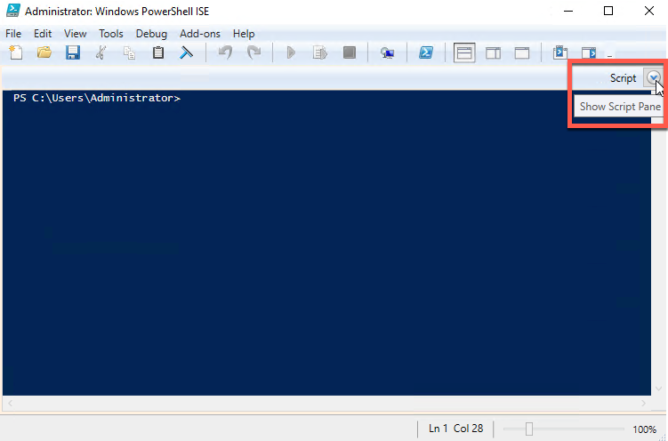
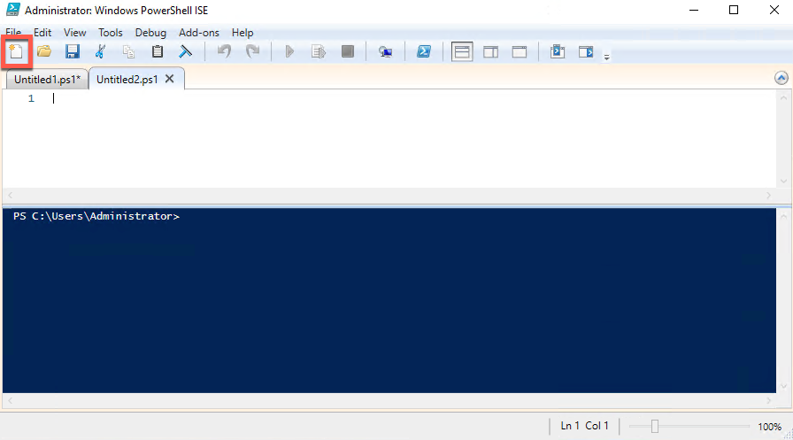
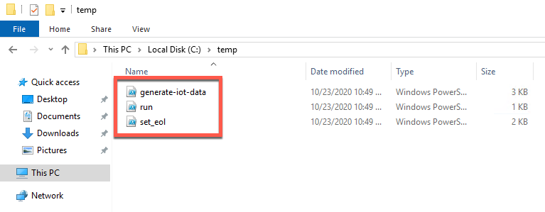
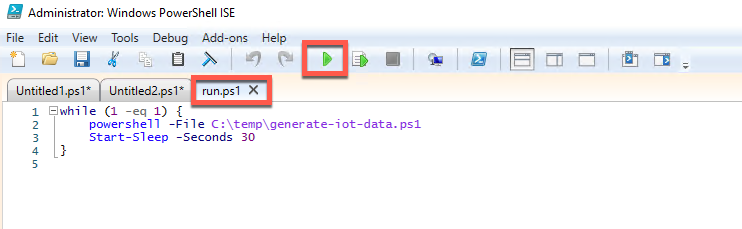

# Generate test data

Execute the following steps to generate test data that will be ingested by AWS IoT Greengrass, written to IoT Core, and then sent to AWS IoT Analytics and visualized by Amazon QuickSight:

Make sure you have the CloudFormation outputs handy. You'll need these IPs for multiple provisioning steps.
1. [Login to the Windows server via RDP](https://docs.aws.amazon.com/AWSEC2/latest/WindowsGuide/connecting_to_windows_instance.html). Connect using the `WindowsIoTPublicIp` CloudFormation output, and use the keypair you created earlier to decrypt the Windows administrator password.
1. Map a network drive on the Windows server to the samba share running on the Linux server:
    - Click the Start button and open a new PowerShell ISE window.

        
    - Expand the script pane.

        
    - Paste the following commands into the script pane of the ISE window, replacing `<private-ip>` with the `GreengrassPrivateIP` CloudFormation output you wrote down earlier. Run the commands by clicking the green play button.
        ```powershell
        $user = "iot"
        $password = ConvertTo-SecureString -String "iotaccess" -AsPlainText -Force
        $credential = New-Object -TypeName System.Management.Automation.PSCredential -ArgumentList $user, $password
        New-PSDrive –Name "Z" –PSProvider FileSystem –Root "\\<private-ip>\iotshare" -Credential $credential –Persist 
        ```
        
        
        > NOTE: Use a more secure authentication method for your file shares in a real production environment.

1. Create the test data:
    - Open a new ISE tab by clicking the new file icon. 

        
    - Paste the following commands into the new tab and click run them by clicking the green play button.
        ```powershell
        New-Item -ItemType Directory -Force -Path 'C:\temp'

        Write-Host 
        @"
        `$file_path` = 'z:\iotdata.csv'

        New-Item -ItemType Directory -Force -Path C:\temp

        if (-NOT (test-path `$file_path`)) {
            echo "id,location,temperature,time,humidity,weight,size,fatcontent,density,defects,plant,belt,station,employee,rating" >> `$file_path`
        } else {
            return
        }

        function buildString() {
            `$sizes` = "small","medium","large"
            `$levels` = "low","medium","high"
            `$employees` = "101245","208673"
            
            `$newString` = ''
            `$newString` += (get-random -Maximum 999999 -Minimum 100000) # id
            `$newString` += ","
            `$newString` += "arkansas," # Location
            `$newString` += (get-random -Maximum 75 -Minimum 50) # Temperature
            `$newString` += ","
            `$newString` += (Get-Date -Format "MM/dd/yyyy-HH:mm:ss") # Timestamp
            `$newString` += ","
            `$newString` += (get-random -Maximum 50 -Minimum 30) # Humidity
            `$newString` += ","
            `$newString` += (get-random -Maximum 40 -Minimum 5) # Weight
            `$newString` += ","
            `$newString` += (get-random -InputObject `$sizes`) # Size
            `$newString` += ","
            `$newString` += (get-random -InputObject `$levels`) # Fat content
            `$newString` += ","
            `$newString` += (get-random -InputObject `$levels`) # Density
            `$newString` += ","
            `$newString` += (get-random -Maximum 5 -Minimum 0) # defects
            `$newString` += ","
            `$newString` += "plant1," # Plant
            `$newString` += "4," # Belt
            `$newString` += "2," # Station
            `$newString` += (get-random -InputObject `$employees`) # Employee
            `$newString` += ","
            `$newString` += (get-random -Maximum 9 -Minimum 0) # Rating

            return `$newString`
        }

        for (`$i`=0;`$i` -lt 10;`$i`++) {
            buildString >> `$file_path`
            Start-Sleep -Seconds 1
        }

        C:\temp\set_eol.ps1 -lineEnding unix -file `$file_path`
        "@ > C:\temp\generate-iot-data.ps1

        Write-Host 
        @"
        [CmdletBinding()]
        Param(
        [Parameter(Mandatory=`$True`,Position=1)]
            [ValidateSet("mac","unix","win")] 
            [string]`$lineEnding`,
        [Parameter(Mandatory=`$True`)]
            [string]`$file`
        )

        # Convert the friendly name into a PowerShell EOL character
        Switch (`$lineEnding`) {
        "mac"  { `$eol`="``r" }
        "unix" { `$eol`="``n" }
        "win"  { `$eol`="``r``n" }
        } 

        # Replace CR+LF with LF
        `$text` = [IO.File]::ReadAllText(`$file`) -replace "``r``n", "``n"
        [IO.File]::WriteAllText(`$file`, `$text`)

        # Replace CR with LF
        `$text` = [IO.File]::ReadAllText(`$file`) -replace "``r", "``n"
        [IO.File]::WriteAllText(`$file`, `$text`)

        #  At this point all line-endings should be LF.

        # Replace LF with intended EOL char
        if (`$eol` -ne "``n") {
        `$text` = [IO.File]::ReadAllText(`$file`) -replace "``n", `$eol`
        [IO.File]::WriteAllText(`$file`, `$text`)
        }
        Echo "   ** Completed **" 

        # Source: https://ss64.com/ps/syntax-set-eol.html
        "@ > C:\temp\set_eol.ps1

        Write-Host 
        @"
        while (1 -eq 1) {
            powershell -File C:\temp\generate-iot-data.ps1
            Start-Sleep -Seconds 30
        } 
        "@ > C:\temp\run.ps1 
        ```
    - Open a Windows Explorer window and navigate to `C:\temp` to validate that the previous commands created three PowerShell scripts. We'll use these to generate test data.

        
    - Return to the PowerShell ISE window and open the `C:\temp\run.ps1` file. Run it by clicking the green play button. 
        > This script will loop indefinitely, creating sample data and writing it to the samba share until you stop it. It will generate a new flat file (.csv) every 30 seconds in the `iotshare` samba share you mapped to the `Z:\` drive earlier.

        
1. Verify data is being written to the file share:
    - You can verify that the file is being written to the share by returning to your ssh session connected to the Greengrass Linux server and running the following command:
        ```bash
        cat /samba/iot/iotdata.csv
        ```

        

        > You may have to run this a few times to see the file contents because it is continually being written by the Windows server and then processed and deleted by the Lambda function. The Lambda function parses the data in the .csv file, converts it to JSON, and writes the data into an MQTT topic that is picked up by AWS IoT.
    - You can also watch the file in Windows Explorer to see it continually written then processed and deleted.